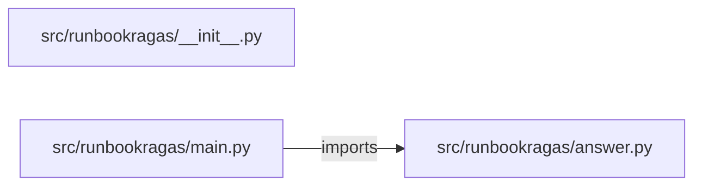

# runbook-rag-assistant — project architecture

[README](README.md) · [Interview questions and answers](INTERVIEW_QA.md)

## Purpose and scope

Answer only from a tiny local corpus. A question with too little overlap is refused.

This document describes files and symbols in this checkout. Deployment templates and statements in the original overview are distinguished from a verified running environment.

## Component diagram



For Python repositories, arrows show resolved local imports, not network calls or deployment order. Otherwise the diagram is a repository component map; containment arrows do not assert runtime integration.

## Components and responsibilities

| Component | Responsibility |
| --- | --- |
| [`src/runbookragas/main.py`](src/runbookragas/main.py) | HTTP handlers: `GET /healthz`, `POST /ask` |
| [`src/runbookragas/answer.py`](src/runbookragas/answer.py) | Functions: `words`, `answer` |
| [`requirements.txt`](requirements.txt) | Implementation or supporting configuration |
| [`src/runbookragas/__init__.py`](src/runbookragas/__init__.py) | Implementation or supporting configuration |
| [`tests/test_ask.py`](tests/test_ask.py) | Executable checks and regression examples |
| [`.github/workflows/ci.yml`](.github/workflows/ci.yml) | GitHub Actions job definitions |
| [`README.md`](README.md) | Project explanations or operating notes |

## Request interface

| Method and path | Handler | Source |
| --- | --- | --- |
| `GET /healthz` | `healthz` | [`src/runbookragas/main.py`](src/runbookragas/main.py#L8) |
| `POST /ask` | `post_ask` | [`src/runbookragas/main.py`](src/runbookragas/main.py#L13) |

The table lists literal route decorators found in the inspected Python modules. Router prefixes and middleware can add behavior; check the linked handler and application setup before calling an endpoint.

## Implementation walkthrough

### `answer(question, source=None)`

Source: [`src/runbookragas/answer.py`](src/runbookragas/answer.py#L16).

Calls visible in this function: `InputError`, `isinstance`, `len`, `question.strip`, `ranked.append`, `ranked.sort`, `words`.

```python
def answer(question, source=None):
    if not isinstance(question, str) or not question.strip():
        raise InputError("question is empty")
    corpus = PASSAGES
    if source is not None:
        corpus = [item for item in corpus if item[0] == source]
        if not corpus:
            raise InputError(f"unknown source: {source}")
    query = words(question)
    ranked = []
    for name, text in corpus:
        overlap = query & words(text)
        ranked.append({"source": name, "text": text, "overlap": len(overlap)})
    ranked.sort(key=lambda row: (-row["overlap"], row["source"]))
    best = ranked[0]
    if best["overlap"] < MIN_OVERLAP:
        return {"answered": False, "answer": "No passage shares enough terms.", "citation": None, "passages": ranked}
    return {"answered": True, "answer": best["text"], "citation": best["source"], "passages": ranked}
```

### `words(text)`

Source: [`src/runbookragas/answer.py`](src/runbookragas/answer.py#L12).

Calls visible in this function: `re.findall`, `set`, `text.lower`.

```python
def words(text):
    return set(re.findall(r"[a-z0-9]+", text.lower())) - STOP
```

## Validation and failure paths

| Explicit exception | Source |
| --- | --- |
| `InputError('question is empty')` | [`src/runbookragas/answer.py`](src/runbookragas/answer.py#L18) |
| `InputError(f'unknown source: {source}')` | [`src/runbookragas/answer.py`](src/runbookragas/answer.py#L23) |
| `HTTPException(status_code=422, detail=str(exc))` | [`src/runbookragas/main.py`](src/runbookragas/main.py#L17) |

These are explicit exceptions in the inspected source, rather than a claim that every failure is handled. Follow the calling handler to see whether the exception becomes an HTTP response or propagates.

## Data and state

- [`src/runbookragas/answer.py`](src/runbookragas/answer.py) defines module-level containers: `STOP`, `PASSAGES`.

Module-level dictionaries/lists live in a Python process. They can be fixtures or mutable state; inspect writes before treating them as persistent storage. A production extension would need to define persistence and concurrency behavior explicitly.

## Data flow and design decisions

### What is the input-to-output contract of `answer`

In [`src/runbookragas/answer.py`](src/runbookragas/answer.py#L16), `answer(question, source=None)` receives the inputs. The function computes these intermediate values:

- `corpus = PASSAGES`
- `query = words(question)`
- `ranked = []`
- `best = ranked[0]`

Its result is defined by:

- `{'answered': True, 'answer': best['text'], 'citation': best['source'], 'passages': ranked}`
- `{'answered': False, 'answer': 'No passage shares enough terms.', 'citation': None, 'passages': ranked}`

### Which decision rules or boundary conditions should an interviewer challenge

The implementation in [`src/runbookragas/answer.py`](src/runbookragas/answer.py#L16) branches on:

- `not isinstance(question, str) or not question.strip()`
- `source is not None`
- `best['overlap'] < MIN_OVERLAP`
- `not corpus`

A useful extension is a table-driven test that covers each condition just below, at, and above its boundary where applicable. These expressions are the current rules; changing them changes behavior and should be justified by the project’s acceptance criteria.

## Setup and verification

The following commands are derived from the checked-in dependency/test contracts. Execute them from the repository root; the block prepares a local environment, not a cloud deployment.

```bash
python3 -m venv .venv
source .venv/bin/activate
python -m pip install -r requirements.txt
python -m pytest -q
```

Python dependencies: [`requirements.txt`](requirements.txt).

Test entry points: [`tests/test_ask.py`](tests/test_ask.py).

Automation definitions: [`.github/workflows/ci.yml`](.github/workflows/ci.yml). Read their triggers and job steps to determine what CI actually runs.

## Operating boundaries and design review

Before turning this checkout into a customer deployment, establish the input contract, data ownership, access controls, failure response, evaluation criteria, and rollback owner. Repository fixtures and unit tests demonstrate local behavior; they do not establish throughput, uptime, compliance, or business impact.

A useful architecture review starts with the linked implementation: identify where input enters, where a decision is made, which state can change, and which external dependency can fail. Add a deployment view only for infrastructure that is actually configured and exercised.
